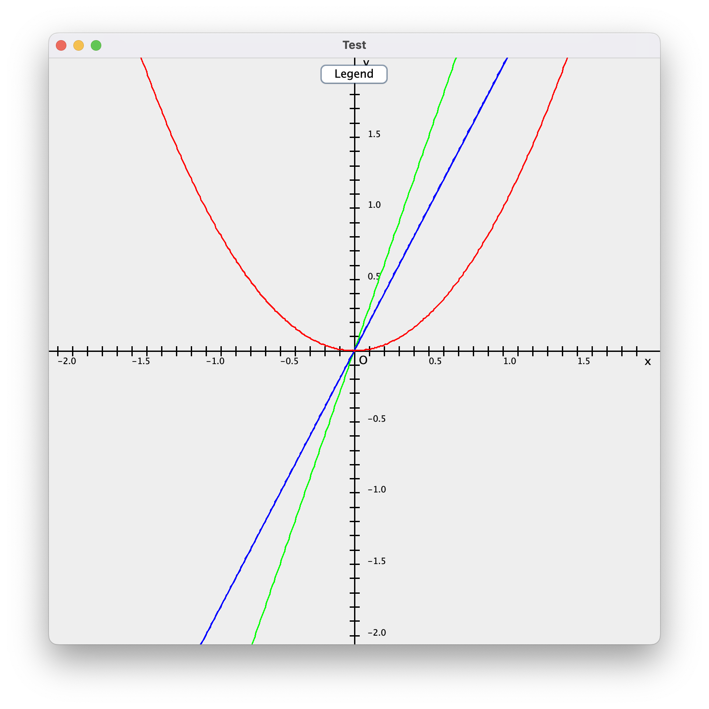

# Advanced Math

This java library extends `java.lang.Math` API to deal with some more complex tasks, like:
- Translating string expressions into binary trees
- Numbers in the complex set (which includes real numbers)
	- Work with real values, which can be constant, floating or fractions
- Functions and their derivatives
	- Plotting those functions on a graph
- Matrices, determinants, and operations on them (transposing, swapping, adding, subtracting, ...)

## Included Packages

Review the documentation for detailed description of every method in the following classes (titles are packages)

### Numbers
1. `Value` (Abstract): 
	1. `ConstantValue`: used for constant values, irrationals, ... e.g. sqrt(3), ln(5), π, ...
	1. `FractionValue`: represents a fraction with integer numerator and denominator
	1. `FloatValue`: wraps a `Double` value
1. `Number`: represents any number in the Complex Set (in the form a + bi, a and b are real values)
1. `Matrix`: represents matrices of any size

### Functionalities
1. `BinaryOperators` (Enum): and, or, xor, rotate, shift ...
1. `Operators` (Enum): contains arithmetic operators (+, -, ...) as well as mathematical functions. Used for constructing the tree
1. `Graph`: plots functions in a new JFrame (uses `java.swing` and `java.awt`)
1. `Operations`: implements some methods that do not exist in other classes but uses the latter

### EqTree
1. `Node` (Abstract): Used to convert a string into a binary tree
	1. `NumberNode`: (leaf) holds a `Number`
	1. `VariableNode`: (leaf) represents a variable
	1. `OperatorNode`: represents an operation between two other nodes, or a mathematical function

## Examples

1. 
>
>```java
>Node n = Node.parse ("e^(i*π/2)");
>System.out.println (n);
>System.out.println (Number.valueOf (n, null));
>```
> output
>```
> e^(i*π/2)
> i
>```

2. 
>
>```java
>Graph graph = new Graph (-2, 2, "Test", null, null);    
>Function f = new Function ("f", new String[]{"x"}, "x^2");
>Function g = new Function ("g", new String[]{"x"}, "3x");
>graph.plot (f, Color.RED);
>graph.plot (g, Color.GREEN);
>graph.plot (f.derive ("x"), Color.BLUE);
>graph.show();
>```
> output
> 

3. 
>
>```java
>Number two = Number.real (2.0);
>Matrix m1 = new Matrix 
>(new Number[]
>	{
>		two,
>		Number.ONE.negate(),
>		two.negate(),
>		Number.real (6.0),
>		Number.ONE.negate(),
>		Number.ONE,
>		Number.real (4.0),
>		Number.real (5.0),
>		Number.real (3.0)
>	},
>		3
>);
>System.out.println (m1);
>System.out.println (m1.determinant());
>```
> output
>```
>[
>2       -1      -2
>6       -1      1
>4       5       3
>]
>-70
>```

4. 
>```java
>Matrix m1 = Matrix.diagonal
>(
>	new Number[]
>	{
>		Number.real (2.0), 
>		Number.ONE.negate(), Number.real (3.0)
>	}
>);
>System.out.println (m1);
>System.out.println (m1.determinant());
>```
> output
>```
>[
>2       0       0
>0       -1      0
>0       0       3
>]
>-6
>```

5. 
>```java
>System.out.println (Number.real(5.4).factorial()); 
>```
> output
>```
>120
>```

6. 
>```java
>// Solve -2x^3 + 9x^2 + 168x - 3 = 0
>Matrix eq = Matrix.rowVector
>(
>	new Number[]
>	{
>		Number.real (-2.0),
>		Number.real (9.0),
>		Number.real (168.0),
>		Number.real (-3.0)
>	}
>);
>System.out.println (Operations.solveCubic (eq));
>```
> output
>```
>[
>11.680486768687597      -7.198326928891037      0.017840160203439037
>]
>```